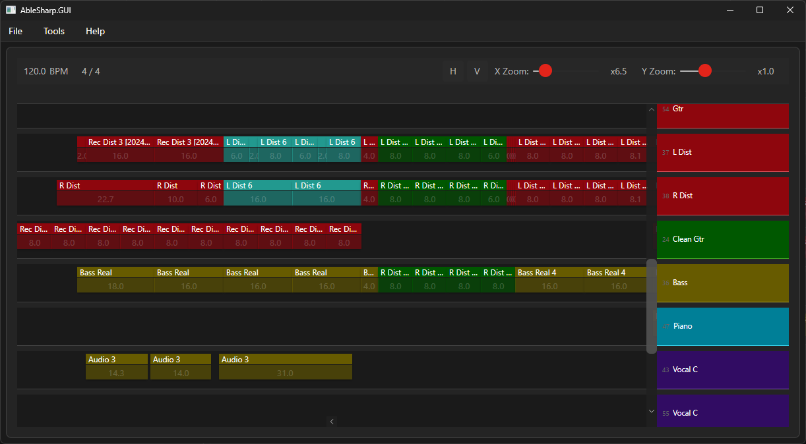

# AbleSharp

A cross-platform .NET toolkit for creating and manipulating Ableton Live project files (.als).

**Currently only tested on Ableton Live Suite v12+ projects.**



## Features

- Read and write Ableton Live project files (.als)
- Merge multiple projects into one
- Analyze project structure and content
- Cross-platform support (Windows, macOS, Linux)
- Both GUI and CLI interfaces
- Modern .NET implementation

## Project Structure

- **AbleSharp.Lib**: Core library implementing the Ableton Live Set format
- **AbleSharp.SDK**: High-level API for integrating AbleSharp into applications
- **AbleSharp.CLI**: Command-line interface for basic file operations
- **AbleSharp.GUI**: Desktop application for visual project manipulation, built with Avalonia

## Getting Started

### Using the GUI

1. Download the latest release for your platform
2. Launch AbleSharp.GUI
3. Open an Ableton Live project file (.als)
4. Use the visual interface to inspect and modify the project

### Using the CLI

Basic commands:

```bash
# Open and validate a project file
ablesharp open project.als

# Create a new empty project
ablesharp create new_project.als

# Merge multiple projects
ablesharp merge -o output.als project1.als project2.als

# Dump project info
ablesharp open --dump project.als
```

### Using the SDK

```csharp
using AbleSharp.SDK;

// Load a project
var project = AbletonProjectHandler.LoadFromFile("project.als");

// Merge projects
var projects = new List<AbletonProject> 
{
    AbletonProjectHandler.LoadFromFile("project1.als"),
    AbletonProjectHandler.LoadFromFile("project2.als")
};
var merged = AbletonProjectMerger.MergeProjects(projects);

// Save changes
AbletonProjectHandler.SaveToFile(merged, "output.als");
```

## License

This project is licensed under the MIT License - see LICENSE.md